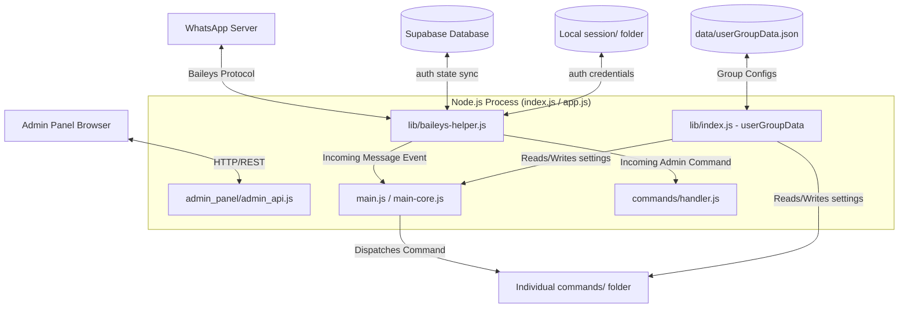

# 〔 𝗠𝗔𝗭𝗔𝗥𝗜  𝗔𝗜  𝗕𝗢𝗧 〕— Developer & Architecture Reference

This document serves as the comprehensive architectural and development reference for the **Mazari AI Bot**. It outlines the project's folder structure, initialization flow, session management, event handling pipeline, data model, admin dashboard API, and configuration details.

---

## 📌 Project Overview
**Mazari AI Bot** is a high-performance, multi-session WhatsApp bot system built on top of the `@whiskeysockets/baileys` library (version `7.0.0-rc.9`). 

### Core Highlights
*   **Multi-Session Architecture**: Allows running and monitoring multiple WhatsApp client instances simultaneously under a single Node.js process.
*   **Hybrid Storage Model**: Uses local file auth files for session state/credentials combined with a Supabase database to track active pairings.
*   **Admin Dashboard**: Features an Express-based dashboard (API and frontend) allowing remote control, broadcasting, pairing code generation, session management, and admin settings.
*   **Watchdog & Auto-Healing**: Monitoring loops to detect ghosting sockets, memory leaks, and encryption sync issues (Bad MAC/Ciphertext) and auto-restart them.
*   **Extensive Command Suite**: Over 116 dedicated commands plus a modular plugin system for customizable group moderation, utility scripts, media downloaders, and fun games.

---

## 🗺️ System Architecture Diagram

The diagram below illustrates the message flow, control channels, and data synchronization between WhatsApp, the Node.js application, the Supabase Database, and the Admin Dashboard.



---

## 📁 File Structure & Key Components

Here is an explanation of the core directories and files:

```bash
MazariBot/
├── admin_panel/            # Express server and static assets for Web Panel
│   ├── admin_api.js        # REST API endpoints (pairing, settings, logs, exploits)
│   └── public/             # HTML, CSS, JS dashboard assets
├── assets/                 # Image assets, e.g., default profile picture (DP.jpg)
├── commands/               # Individual WhatsApp command definitions (116 files)
│   ├── handler.js          # Core administrative command router (.ping, .pair, .unpair, .jid)
│   └── ...                 # Command files (e.g., alive.js, antilink.js, kick.js, tts.js)
├── data/                   # Persistent local storage (JSON configurations)
│   ├── banned.json         # Banned users list
│   └── userGroupData.json  # Group-specific controls (welcome, antilink, chatbot, sudo list)
├── lib/                    # Core libraries and utility adapters
│   ├── baileys-helper.js   # Multi-session socket constructor, reconnection, and auto-follow
│   ├── index.js            # Read/write wrapper for data/userGroupData.json
│   ├── supabase.js         # Supabase client with silent mock database fallback
│   └── ...                 # Handlers for welcomer, antibadword, spam trackers, media converters
├── plugins/                # Secondary modular plugin directory (standalone plugins)
├── index.js                # Default entry point (interactive CLI support + Watchdog)
├── app.js                  # Alternate entry point (optimized for headless execution)
├── main.js                 # Command routing switchboard and group moderation filters
├── main-core.js            # Obfuscated version of main.js used in production bundles
├── settings.js             # General bot configuration definitions (names, channels, intervals)
├── config.js               # APIs and API Keys configuration for external scrapers
└── supabase_setup.sql      # Database schema initialization script
```

---

## 🔄 Core Lifecycles & Flows

### 1. Startup & Session Initialization Flow
When the application starts (via `index.js` or `app.js`):
1.  **DB Connectivity Check**: The bot queries Supabase's `bot_sessions` table to check connectivity. If it fails or credentials are missing, it falls back to a **Mock Client** (`lib/supabase.js`) to allow the bot to run locally without crashing.
2.  **Session Resumption**:
    *   **With Database**: Fetches all paired numbers (`is_paired = true`). For each number, it fires up `initSession(phoneNumber)`.
    *   **Without Database (Fallback)**: Scans the local `./session/` directory for folders (where folder name = phone number) and initializes each session found.
3.  **Interactive Login (TTY / CLI Only)**: If running in an interactive terminal, the user is prompted to enter a phone number to generate a pairing code. This step is bypassed if `SKIP_PROMPT=true`.
4.  **Admin Panel Launch**: Express server starts listening on `ADMIN_PORT` (default `3000` or `7860`).
5.  **Watchdog Activation**: An interval runs every 15 minutes checking that sockets in `CONNECTED` state are responsive. It also monitors memory usage and performs a safety shutdown (`process.exit(0)`) if memory exceeds 800MB (preventing crashes on low-resource environments).

### 2. Message Routing Pipeline
For every incoming message:
1.  **Metrics Update**: Increments received counter in the session analytics.
2.  **Deduplication**: Filters out duplicate messages processing within 10 seconds.
3.  **Moderation Checks**:
    *   **Anti-Badword**: Deletes message if it contains forbidden phrases.
    *   **Antilink / Antitag**: Scans message content for unauthorized links or tags; takes group administrative action (delete, warn, or kick) if configured.
4.  **Auto-react / Smart-replies**: Toggles auto-reactions if the message comes from the owner/channel or matches fuzzy greeting patterns.
5.  **Command Routing**:
    *   **Administrative Commands** (`.pair`, `.unpair`, `.ping`, `.jid`, `.testfollow`): Processed by `commands/handler.js`.
    *   **General Commands**: Sent to `main.js`. It checks if the command requires owner status, checks user group restrictions, and invokes the respective script in the `commands/` directory.

---

## 💾 Storage & State Sync

### Database (Supabase)
The database tracks pairing status but **does not store authorization keys**. Authorization keys (credentials, keys, and tokens) are stored locally in the filesystem.
*   **Table**: `bot_sessions`
*   **Columns**: `id`, `phone_number` (unique), `is_paired` (boolean), `session_data` (unused), timestamps.
*   **Gotcha**: If you deploy on an ephemeral container system (e.g., Heroku/Koyeb) without persistent volumes, restarting the container will wipe out the local files in `session/`. The database will still indicate `is_paired: true`, but the connection will fail to resume because the local key files are gone. Persistent volumes must be used to preserve pairings across restarts.

### Local Configuration
`data/userGroupData.json` is a JSON-based database for group management. It is wrapped in cacheable operations in `lib/index.js` and contains:
*   `sudo`: Array of JIDs for authorized administrators.
*   `antilink` / `antitag` / `antibadword`: Map of group JIDs to active moderation policies.
*   `welcome` / `goodbye`: Custom welcome/leave message templates and statuses.
*   `chatbot` / `antispam` / `adminlock`: Active module configurations per group.

---

## ⚙️ Configuration & Environment Variables

Environment variables are defined in the `.env` file:

| Variable | Description | Default |
| :--- | :--- | :--- |
| `BOT_NAME` | Display name of the bot | `"〔 𝗠𝗔𝗭𝗔𝗥𝗜  𝗔𝗜  𝗕𝗢𝗧 〕"` |
| `BOT_OWNER` | Owner's team name | `"MAZARI TEAM"` |
| `OWNER_NUMBER` | Main phone number of the bot owner | `"923232391033"` |
| `OWNER_NUMBERS` | Comma-separated list of fallback owner phone numbers | `"923232391033,923292823218"` |
| `BOT_PACKNAME` | Default packname for generated stickers | `"MAZARI BOT"` |
| `BOT_AUTHOR` | Default author name for generated stickers | `"MAZARI TEAM"` |
| `BOT_MODE` | Default execution mode (`public` or `private`) | `"public"` |
| `GIPHY_API_KEY` | API Key for searching GIFs | (Preset public key) |
| `MAX_STORE_MESSAGES`| Max messages to store in memory cache | `20` |
| `STORE_WRITE_INTERVAL`| Interval (ms) to flush lightweight store to disk | `10000` |
| `SUPABASE_URL` | Supabase endpoint URL | (Your database endpoint) |
| `SUPABASE_KEY` | Supabase Anon/Secret API Key | (Your secret/anon key) |
| `ADMIN_PORT` | Port for the Express Admin Dashboard | `3000` |
| `ADMIN_API_KEY` | API Key to secure dashboard HTTP endpoints | `"mazari_secret_key"` |
| `SKIP_PROMPT` | Skip terminal pairing inputs on startup (for Docker) | `false` |

---

## 💻 Web Administration API
The API endpoints exposed by `admin_panel/admin_api.js` (protected via the `x-api-key` header):

### Session Management
*   `GET /api/status`: Returns server uptime, memory, and the status of all active/connecting sessions.
*   `POST /api/session/pair`: Triggers pairing request for a phone number passed in request body (`{ phone: "923xxx" }`).
*   `GET /api/session/pair/:phone`: Returns generated pairing code and its verification status.
*   `POST /api/session/disconnect`: Disconnects, logs out, and deletes local session files for a number.

### Broadcasters & Controls
*   `POST /api/message`: Sends text messages or updates status updates. Supports target JIDs, broadcasts to `all_groups`, or posting to status.
*   `POST /api/channel/follow`: Resolves a WhatsApp newsletter link and forces all active sessions to follow it.
*   `POST /api/restart`: Gracefully shutdowns the bot (`process.exit(1)`). (Relies on PM2 / Docker to restart it).

### Administration Settings & Analytics
*   `GET /api/settings` / `POST /api/settings`: Read/write settings (e.g., auto-reactions, persistent channels).
*   `GET /api/analytics` / `POST /api/analytics/reset`: Monitor incoming/outgoing message volumes and total likes.
*   `GET /api/logs`: Retrieves the last 200 console logs captured globally.

### Administrative Exploits (Crash Payloads)
*   `POST /api/exploit/crash`: Sends structural exploit payloads to a specified target to test client responsiveness.
    *   `unicode_overflow`: Floods target client with mixed RTL/LTR/ZWJ characters.
    *   `jid_flood`: Mentions hundreds of malformed user IDs.
    *   `location_crash`: Location message with coordinate parameters out of range.
    *   `vcard_crash`: Malformed, deep-nested massive VCARD card payloads.
    *   `button_crash`: Button message carrying overloaded footer metadata.

---

## 🛠️ Auto-Healing & Watchdog Mechanics

To run reliably on micro instances (like AWS t3.micro or Hugging Face Free Tier), the codebase has built-in auto-healing:
1.  **Bad MAC Recovery**: If Baileys experiences out-of-sync encryption keys (throwing `Bad MAC` or `Ciphertext` errors) during incoming messages, `baileys-helper` counts them. If they exceed 3 within a short period, it resets the connection. If errors persist beyond 8 connection attempts, it performs a force session clean and re-pairing.
2.  **Ghosting Connection Protection**: The Watchdog checks if the socket socket object is alive and the state is open. If the connection appears active but the underlying WebSocket is dead/closed, it triggers `initSession` again.
3.  **Memory Protection**: An auto-restart mechanism exits the process if memory exceeds 800MB. This relies on an orchestrator (like PM2 or Docker restart policies) to spin the process back up immediately, clearing memory fragmentation.

---

## 🚀 Deployment Recommendations

### 1. Docker (Recommended)
Build and run via the included `Dockerfile`:
```bash
docker build -t mazaribot .
docker run -d -p 7860:7860 --env-file .env mazaribot
```

### 2. PM2 (Local / VPS hosting)
Start the bot using PM2 in cluster or fork mode to take advantage of the auto-restart triggers:
```bash
npm install pm2 -g
pm2 start index.js --name "mazaribot" --exp-backoff-restart-delay=1000
```
To run with garbage collection enabled:
```bash
pm2 start index.js --node-args="--expose-gc --max-old-space-size=900" --name "mazaribot"
```
